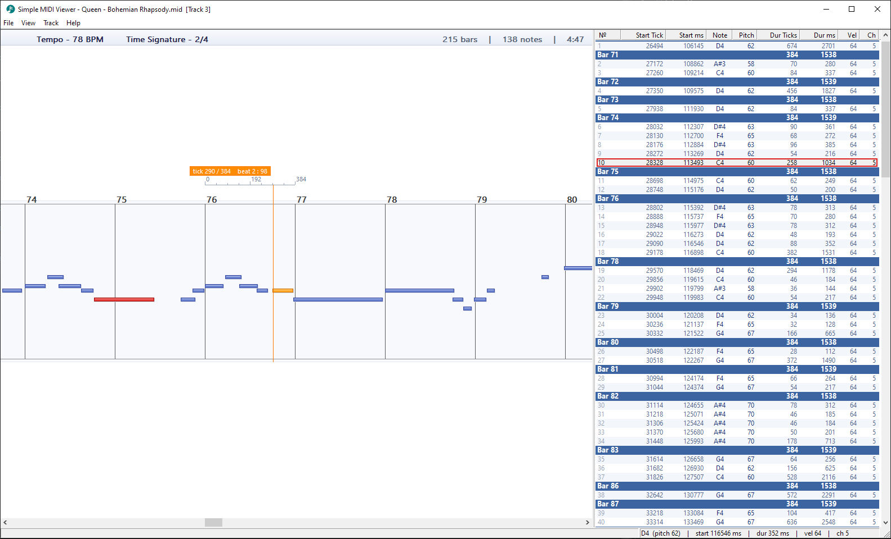
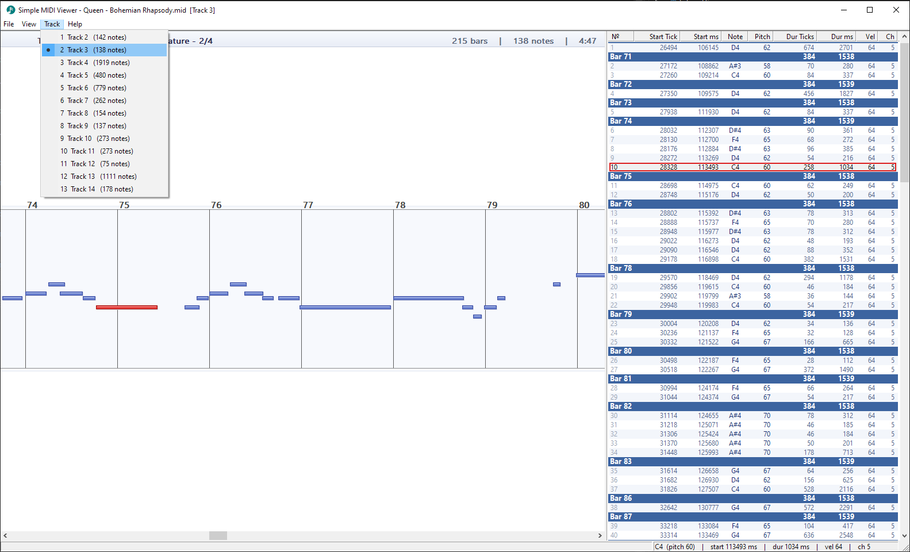

# Simple MIDI Viewer - Score & Note Inspector

A lightweight Windows desktop app for inspecting **Standard MIDI Files** (`.mid` / `.midi`): a piano-roll score, a synchronized note table, and tick-accurate timing tools.


> **Built on raw WinAPI / MFC by design.** No Qt, no Electron, no .NET, no
> third-party libraries. The result is a single, self-contained `.exe` that is
> **fast, tiny, and dependency-free** - it starts instantly, uses very little
> memory, and runs on any Windows machine with nothing to install.

---

## Screenshots





---

## Features

- **Piano-roll score** - notes as pitch/time rectangles, shaded by velocity, with a soft shadow and highlight; one semitone per lane so notes never overlap vertically
- **Bar-grouped note table** - start tick, start ms, note name, pitch, duration (ticks & ms), velocity and channel, organized by bar
- **Two-way selection sync** - click a note in the score or the list; the other view highlights, scrolls to it, and details appear in the status bar
- **Per-track viewing** - one track at a time; a chooser dialog appears for multi-track files and the **Track** menu switches tracks live (score + table fully reload)
- **Per-bar tick ruler** - hover a bar to get a ruler relative to that bar (starting at 0): beat marks, sub-beat ticks, a live cursor line, and a readout of the exact tick, bar length, beat and tick-in-beat
- **Center-anchored zoom** - `Ctrl + Wheel` or `Ctrl + +/-/0`; the viewport center stays put while zooming
- **Dockable note list** - dock right or bottom, or float it as a separate window
- **Header read-out** - tempo (BPM), time signature, bar count, note count and total duration
- **Correct timing math** - honors tempo and time-signature changes for tick to ms / bar conversions; track names decoded as UTF-8 with a system-codepage fallback (Cyrillic etc. display correctly)
- **Self-contained** - static MFC + static CRT, so the `.exe` runs with no extra redistributables

---

## Why native (WinAPI / MFC)?

This project is **deliberately** built directly on the Windows API through MFC,
instead of a cross-platform UI framework. That choice is the point, not a
limitation:

- **Fast** - native windows and GDI drawing, double-buffered; no managed
  runtime, no web engine, no JIT warm-up. The app opens and reacts instantly.
- **Compact** - the whole program is a single small executable. There is no
  bundled browser, no framework runtime, no extra DLLs to ship.
- **Dependency-free** - no Qt, Electron, .NET, or other third-party libraries.
  It links only standard Windows system libraries, with **static MFC** and the
  **static CRT**, so the `.exe` runs on a clean Windows install with **nothing
  to download or install** - just copy and run.
- **Lightweight at runtime** - minimal memory footprint and no background
  services.

If you want a tiny, instant, self-contained Windows tool, this is exactly the
kind of build that delivers it.

---

## Requirements

| Item | Details |
|------|---------|
| OS | Windows 10 / 11 |
| Toolchain | Visual Studio 2022, **Desktop development with C++** workload |
| Components | **MFC** (C++ ATL/MFC) |
| Build system | CMake 3.20+ (the one bundled with Visual Studio works) |
| Input files | Standard MIDI Files, format 0 or 1 (`.mid` / `.midi`) |

---

## Building

### Prerequisites

- Visual Studio 2022 with the **MFC** and **C++ Desktop** components
- CMake 3.20 or newer on `PATH`

### Steps

1. Clone the repository:
   ```
   git clone https://github.com/dgimbialo/SimpleMidiViewer.git
   ```
2. Configure (generates `build/` with a Visual Studio solution):
   ```
   cmake -G "Visual Studio 17 2022" -A x64 -B build
   ```
3. Build the Release configuration:
   ```
   cmake --build build --config Release
   ```

Output: `build\Release\SimpleMidiViewer.exe`

> You can also open `build\SimpleMidiViewer.sln` in Visual Studio after the configure step and build/run from the IDE. Use `--config Debug` for a debug build.

---

## Usage

1. Launch `SimpleMidiViewer.exe`
2. **File > Open** (`Ctrl+O`) and pick a `.mid` / `.midi` file
3. If the file has several tracks, choose one in the dialog
4. Switch tracks any time from the **Track** menu
5. Hover the score to read ticks; click a note to inspect it

### Shortcuts

| Action | How |
|--------|-----|
| Open a file | `Ctrl + O` |
| Zoom in / out / reset | `Ctrl + +` / `Ctrl + -` / `Ctrl + 0` |
| Zoom with the wheel | `Ctrl + Mouse Wheel` |
| Scroll the score | arrow keys, `Home`, `End`, scroll bars |
| Inspect a note | hover or click it (details in the status bar) |
| Tick ruler for a bar | hover the mouse over that bar |
| Switch track | **Track** menu |
| Dock / float the note list | right-click the divider between score and list |

---

## Architecture

```
CSimpleMidiApp
  +-- CMainFrame              Main window: menus, layout, track switching, About
  |     +-- CScoreHeaderBar   Tempo / time signature / stats bar
  |     +-- CScoreView        Piano-roll score, zoom, per-bar tick ruler
  |     +-- CNoteListPanel    Bar-grouped note table (custom-drawn list)
  |     +-- CSizerBar         Draggable splitter (dock right / bottom / float)
  +-- MidiParser              Standard MIDI File reader
  +-- MidiDocument            Parsed model + tick / ms / bar / pitch helpers
```

### Single track at a time

The full file is parsed into `MidiDocument` (all tracks). The chosen track is
copied into a single-track document that shares the file's tempo and
time-signature map, then handed to the score and the note list. Switching
tracks rebuilds both views from scratch.

### Timing math

PPQN (ticks per quarter note) is read from each file's header - it is **not**
a fixed value. Bar length follows the time signature:

```
barTicks = numerator * (4 / denominator) * PPQN
```

For example, a 2/4 bar at 192 PPQN is `2 * (4/4) * 192 = 384` ticks.
Tick to millisecond conversion accumulates every tempo change up to that tick.

---

## Project structure

```
src/
  App.cpp/.h            Application entry point (CWinApp)
  MainFrame.cpp/.h      Main window, menus, layout, track switching, About
  ScoreView.cpp/.h      Piano-roll score, zoom, tick ruler, header bar
  NoteListPanel.cpp/.h  Bar-grouped note table (custom-drawn list)
  MidiParser.cpp/.h     Standard MIDI File parser
  MidiDocument.h        Parsed model + tick/ms/bar/pitch helpers
  SizerBar.cpp/.h       Draggable splitter between score and note list
  AppMessages.h         Internal window messages
  pch.h                 Precompiled header
resources/
  resource.rc/.h        Menu, accelerators, dialogs, icon
  app.ico               Application icon
CMakeLists.txt          Build configuration (static MFC + static CRT)
```

---

## License

MIT License. See [LICENSE](LICENSE) for details.
